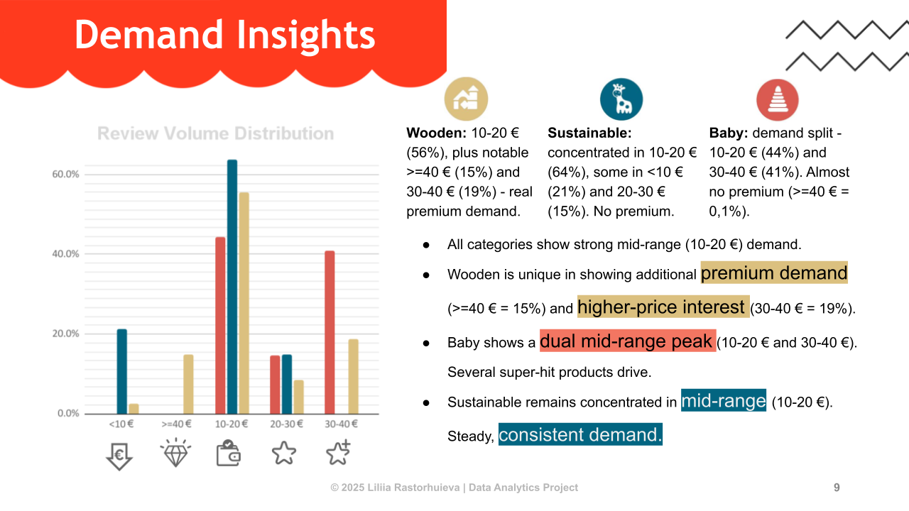

# Amazon Toys Analysis  
  
**Goal:**  
  
Provide actionable insights into toy pricing, popularity, and category positioning to optimize sales.  

**Problem Statement:**    
  
Which toy categories have the highest potential for sales considering price segments, popularity and positioning? 
  
Sub-questions:  
   - How do prices and discounts differ across categories? 
   - Which categories are most popular and why? 
   - Which categories are most popular and why?  
   - Where is the best balance of price vs value (value for money)? 
   - How are categories positioned via keywords (emotional, Montessori, eco)?   
   - Where are anomalies or super-hit products?  
  
**Workflow:**  
  
### Web scraping **-->** Raw CSVs **-->** Cleaning & Normalization **-->** Feature Engineering **-->** Pivot Tables & Aggregation **-->** Visualization & Insights  
[Open Full Notebook](notebook/amazon_toy_market_analysis.ipynb)
  
**Tech Stack:**  
  
Python, Selenium, Pandas, NumPy, Google Sheets / Excel, PowerPoint / Google Slides  
  
**Insights (Summary Table)**  
  
| Category    | Key Insights                                                                 |
|------------|-----------------------------------------------------------------------------|
| Baby       | Mass-market, dependent on hits, emotional triggers, low median value        |
| Sustainable| Budget-friendly, stable demand, high value for money, partially eco, low educational focus |
| Wooden     | Premium, stable popularity, Montessori + Eco positioning, partially sold via discounts, high intrinsic value |  
  
[View Presentation (PDF)](presentation/Amazon_toy_analysis_2025.pdf)  

  
  
**Files & Structure:**  
  
- `data/` – raw and cleaned datasets  
- `notebook/` – analysis notebook  
- `scripts/` – Python scripts for scraping and cleaning  
- `presentation/` – final slides PDF  
  
**Author:**  
  
Liliia Rastorhuieva

