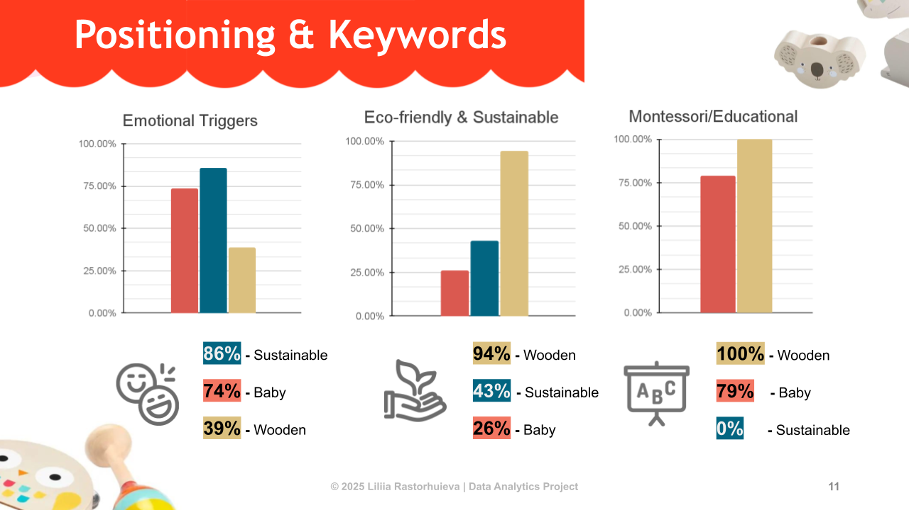

# Amazon Toys Analysis  
  
**Goal:**  
  
Provide actionable insights to optimize toy sales.  

**Problem Statement:**    
  
Identify toy categories with the highest sales potential across different price segments and customer preferences.
  
**Workflow:**  
  
### Web scraping **-->** Raw CSVs **-->** Cleaning & Normalization **-->** Feature Engineering **-->** Pivot Tables & Aggregation **-->** Visualization & Insights  

Follow the step-by-step data processing and analysis in the project notebook: [Open Full Notebook](notebook/amazon_toy_market_analysis.ipynb)
  
**Tech Stack:**  
  
Python, Selenium, Pandas, NumPy, Google Sheets, Google Slides  

**Visualization & Insights:**  

- Project insights available in the presentation: [View Presentation (PDF)](presentation/Amazon_toy_analysis_2025.pdf)  
 
  

- Summary Table: 
  
| Category    | Key Insights                                                                 |
|------------|-----------------------------------------------------------------------------|
| Baby       | Mass-market, dependent on hits, emotional triggers, low median value        |
| Sustainable| Budget-friendly, stable demand, high value for money, partially eco, low educational focus |
| Wooden     | Premium, stable popularity, Montessori + Eco positioning, partially sold via discounts, high intrinsic value |  
  
**Files & Structure:**  
  
- `data/` – raw and cleaned datasets  
- `notebook/` – analysis notebook  
- `scripts/` – Python scripts for scraping and cleaning  
- `presentation/` – final slides PDF  
  
**Author:**  
  
Liliia Rastorhuieva

